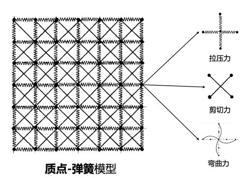

# ClothSimulate

一个使用 Unity 实现的实时布料模拟示例。项目以 GAMES101 中介绍的质点—弹簧模型为基础，通过质点受力、弹簧约束和数值积分模拟布料的实时运动与形变。


## 功能

- 将布料离散为规则排列的质点网格
- 使用结构、剪切和抗弯三类连接保持布料形状
- 使用质点—弹簧系统模拟布料运动
- 支持重力、速度阻尼、恒定外力和随机风力
- 支持固定点、地面碰撞和球体等场景碰撞
- 每帧根据模拟结果重建网格顶点与法线

## 运行项目

1. 使用 Unity Hub 打开仓库目录，推荐使用项目当前版本 `Unity 6000.0.56f1`。
2. 打开 `Assets/Cloth.unity`。
3. 点击 Play 运行场景。
4. 场景中的 `Cloth` 对象挂载了 `MassSpringCloth`，可在 Inspector 中调整质点、弹簧、阻尼与外力参数。

运行时左上角提供两个简单按钮：

- `风力开关`：清空随机风力范围，使随机风停止作用。
- `移除固定节点`：释放顶部固定点，让整块布料自由下落。

## 布料模拟是如何实现的

### 1. 将布料离散为质点网格

`MassSpringCloth.InitMassList()` 创建 `massCount × massCount` 个 `ClothMass`。每个质点保存质量、位置、速度、当前合力以及是否固定等状态。所有质点均匀排列在局部坐标系中，初始间距为 `restLen`，顶部两端默认固定，用来形成悬挂的布料。

这些质点同时也是最终渲染网格的顶点，因此物理模拟得到的新位置可以直接驱动布料表面。

### 2. 用三类弹簧描述布料形变

`MassSpringCloth.InitSprings()` 在质点之间建立三种弹簧：

| 类型 | 连接方式 | 刚度 | 自然长度 | 作用 |
| --- | --- | ---: | ---: | --- |
| 结构弹簧 | 水平、竖直相邻质点 | `ks` | `restLen` | 抵抗经纬方向的拉伸与压缩 |
| 剪切弹簧 | 单元格对角线上的质点 | `0.7 × ks` | `√2 × restLen` | 抵抗布料剪切变形 |
| 抗弯弹簧 | 水平、竖直间隔一个点的质点 | `0.5 × ks` | `2 × restLen` | 抑制过度折叠和弯曲 |



图中右侧的三种局部连接与代码中的约束一一对应：水平和竖直的结构弹簧在相邻质点间产生拉压力，维持经纬方向的基本间距；两条对角线弹簧抵抗网格单元被拉成平行四边形时产生的剪切变形；跨过一个质点连接的抗弯弹簧限制相邻区域的曲率变化，使布料不会轻易发生尖锐折叠。

每条 `ClothSpring` 使用胡克定律计算弹力。令两端质点的位置差为 `x = x_b - x_a`，单位方向为 `n = x / |x|`，弹簧力为：

```text
F_s = k_s (|x| - l_0) n
```

为了吸收振荡，还沿弹簧方向加入速度阻尼：

```text
F_d = -k_d dot(v_a - v_b, n) n
```

两端质点分别累加大小相等、方向相反的 `F_s + F_d`，从而满足作用力与反作用力。

### 3. 累加外力并积分运动

`ClothMass.Simulate()` 为非固定质点累加以下力：

- 重力：`m × 9.78 × down`
- 线性速度阻尼：`-drag × v`
- Inspector 中设置的恒定外力 `externalForce`
- 按 `randomInterval` 更新的随机风力
- 碰撞产生的推出力

得到合力后先计算加速度 `a = F / m`，再使用半隐式欧拉法更新速度和位置：

```text
v(t + dt) = v(t) + a(t) dt
x(t + dt) = x(t) + v(t + dt) dt
```

每帧会执行 `looper` 次子步，单个子步为 `0.01 / looper`。较多的子步通常能提高刚性弹簧的稳定性，但也会增加计算量。

### 4. 碰撞处理

质点—弹簧版本在每个质点上进行两阶段检测：

1. 使用 `Physics.OverlapSphere` 检查质点是否进入球形碰撞体；若发生穿透，则沿球心到质点的方向施加与穿透深度平方相关的推出力。
2. 使用 `Physics.SphereCast` 沿速度方向预测即将发生的碰撞；命中后按接触面法线反射速度，并衰减速度来模拟能量损失。

这种处理方式实现简单，适合演示布料与场景中球体、地面及其他 Collider 的实时交互。

### 5. 从质点生成并更新网格

`MassSpringCloth.CreateMesh()` 将质点位置写入顶点数组，为每个网格单元生成两个三角形，并创建对应 UV。之后每帧执行以下操作：

1. 把最新的质点位置写回 `Mesh.vertices`。
2. 重新计算切线、法线和包围盒。
3. 由 `MeshRenderer` 使用指定材质渲染布料。

因此，物理层只需要更新质点，渲染网格就会随质点一起发生拉伸、弯曲和碰撞形变。

## 主要参数

| 参数 | 含义 |
| --- | --- |
| `massCount` | 每条边的质点数量，总质点数为 `massCount²` |
| `restLen` | 相邻质点的初始距离 |
| `clothMass` | 整块布料质量，会平均分配给所有质点 |
| `ks` / `kd` | 弹簧刚度与沿弹簧方向的阻尼系数 |
| `drag` | 质点速度阻尼 |
| `looper` | 每帧执行的模拟子步数 |
| `externalForce` | 持续施加的外力 |
| `randomForce` | 随机风在 X、Y、Z 三个方向上的取值范围 |
| `randomInterval` | 随机风的刷新间隔 |
| `showMass` | 是否显示用于调试的质点球体 |

## 代码结构

```text
Assets/
├── Scripts/
│   ├── MassSpringCloth.cs       # 质点—弹簧布料初始化、模拟循环和网格更新
│   ├── ClothMass.cs             # 质点受力、积分与碰撞
│   └── ClothSpring.cs           # 胡克弹力和弹簧方向阻尼
├── Cloth.unity                  # 演示场景
└── Materials/                   # 布料材质与 Shader
```
